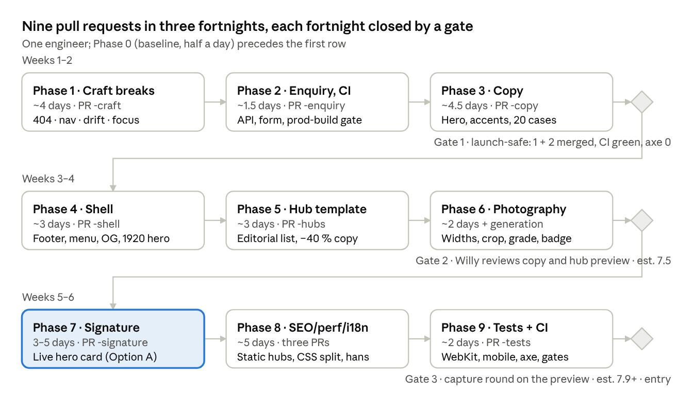

# FimmickWebsite2 Fix Plan — Implementation Brief for Claude Opus 5.5

Oct 4, 2026 · @Willy

This brief turns the 21-item fix plan in `02-FimmickWebsite2-Award-Level-Audit.md` into an executable sequence for a coding agent working in `YNWAforever/FimmickWebsite2`. It is self-contained: every item carries its files, the exact change, and the test that proves it.

## How to run this plan

Work through the phases in order; each phase is one pull request against `main`, opened from a `feat/award-pass-2-<phase>` branch. Phase 1 may be split into two PRs if the diff passes 600 lines. Do not push to `main` directly: the repo convention is feature branch plus PR, and Vercel builds a preview for every PR that Willy reviews before merging.

The loop for every item is the one the audit used: **capture, change, re-capture, measure, compare**. Before touching an item, reproduce the finding on the local production build and save the evidence (screenshot or number) under `docs/redesign/award-2/before/`. After the change, save the matching `after/` evidence and quote both in the PR description. An item whose "after" cannot be shown is not done.

Definition of done for a PR, in this order: `npm run typecheck`, `npm run lint`, `npm test` and `npx playwright test` all green; the new regression test for every item in the PR was run red against the unfixed code first (note the failing run in the PR); the `award.css` cascade test still passes; axe (`@axe-core/playwright`, tags `wcag2a wcag2aa wcag21aa wcag22aa best-practice`) reports zero violations on `/en`, `/zh-hant`, `/zh-hans` and every page the PR touched, at 1440×900 and 390×844 after a full scroll and a 1.5 s settle; Lighthouse mobile on `/en` has not dropped more than 2 points from the Phase 0 baseline; `docs/redesign/award-2/README.md` has a row for the PR with what changed and the before/after numbers.

Stop and ask Willy (in the PR, not by guessing) when: a change needs new copy that the Content tables do not already supply; a design item has two viable layouts and the audit gives no preference; a change would alter a figure, claim, product name, legal text or the honesty-policy wording; or a test cannot be made to pass without loosening it. Everything else in this brief is decided; implement it as written and note any deviation with its reason in the PR.

Working environment notes: the build fetches Manrope and Instrument Serif from Google Fonts. If the sandbox has no egress to `fonts.googleapis.com`, install `@fontsource-variable/manrope` and `@fontsource/instrument-serif` with `--no-save`, point a local copy of `app/fonts.ts` at them with `next/font/local` for the session, and restore the committed `fonts.ts` before every commit (Phase 8 makes self-hosting permanent). Playwright's Chromium lacks H.264, which is exactly what Phase 1 item 6 needs to reproduce the video bug. The repo's own scripts (`scripts/capture-audit.mjs`, `scripts/capture-motion.mjs`, `scripts/qa-sweep.mjs`) expect a server on port 3100.

## Ground rules

These come from `docs/redesign/design-decisions.md` and the two award reports already in the repo. They are not negotiable within this plan; a change that needs one relaxed is a question for Willy.

1. **Runtime dependencies stay `next`, `react`, `react-dom`.** No animation, UI, state or form library. Motion is CSS; JavaScript only sets state (classes, `data-` attributes, positions).
2. **Nothing loops, scroll-jacks or plays audio.** Continuous effects are scroll-linked (`animation-timeline`) and off under `prefers-reduced-motion: reduce`. The hidden reveal state is scoped to `html.js` so content never depends on JavaScript.
3. **The hero photograph is the LCP element and never animates at load.** Only hero copy may move.
4. **Stylesheet order is part of the design.** `award.css` overrides `cinematic.css` at equal specificity and is imported only by `app/[locale]/layout.tsx`, after `cinematic.css`. Shared rules go in `editorial.css`. Any CSS imported by both root layouts is hoisted into the shared chunk and loads first. The e2e test "award styles win the cascade in the production bundle" must stay green after every CSS move.
5. **Scroll-driven effects need non-scrolling ancestors:** `overflow: clip`, never `hidden`, on any box containing a `view()` timeline subject.
6. **Honesty policy stays; its tone changes.** No figures from the 20 anonymised cases; products remain "configured per engagement"; photographs remain labelled as generated illustrations somewhere visible on the page; no "AI workforce / digital employees" metaphors (a unit test enforces this). The audit's rewrites keep every one of these facts and only change the voice.
7. **Legal text (`content/legal.ts`) is verbatim.** Do not edit it, even for the platform-name inconsistency; flag it.
8. **Copy is authored once in English and Traditional Chinese (HK).** Simplified Chinese is generated by `lib/hans.ts`; after any zh-Hant copy change run `npm run i18n:hans` and commit the regenerated table. Never hand-write zh-Hans strings in content files.
9. **Server-first.** Pages are server components; content registries are never imported into client code. New client islands are small and take data as props.
10. **Every finding gets a regression test** before the fix lands, run red first. Prefer a Playwright assertion that measures (a rect, a computed style, a status code) over one that checks a class name.
11. **Do not touch `docs/redesign/cinematic/` or `docs/redesign/award/`** except to add a note that `award-2/` supersedes parts of them; new evidence goes in `docs/redesign/award-2/`.

## Phase 0 — setup and baseline (half a day, no PR)

1. Clone `YNWAforever/FimmickWebsite2`, confirm `git log -1` is `10c886e` or later, `npm ci`, `npm run build` (see the font note above), `npx next start -p 3100`.
2. Run and record: `npm run typecheck`, `npm run lint`, `npm test` (expect 23 passing), `npx playwright test` (expect 25 passing). Any pre-existing failure is reported before work starts, not fixed silently.
3. Capture the baseline into `docs/redesign/award-2/before/`: viewport-by-viewport scroll frames (not `fullPage`, which captures `content-visibility` placeholders) of `/en`, `/zh-hant`, `/en/platform`, `/en/services`, `/en/solutions/content-production`, `/en/industries`, `/en/case-studies/real-estate-sales-follow-up`, `/en/contact`, `/en/knowledge-hub/4-types-of-crm-system`, `/en/about/team` and `/en/nonexistent` at 1440×900, 1200×800, 390×844; the mega menu open; the drawer open at 390 and 1200.
4. Record the baseline numbers in `docs/redesign/award-2/README.md`: Lighthouse mobile and desktop medians of three for `/en`, `/en/platform`, `/en/services`, `/zh-hant` (the audit's values were 94/98/95/91 mobile, 100 desktop); `document.documentElement.scrollHeight` at load and after a full scroll for the same pages at 1440 and 390; axe violation counts; the CSS bytes per route; RSC prefetch bytes on a full scroll of `/en`.
5. Add `@axe-core/playwright` as a devDependency (the only new package in this plan apart from Phase 8's `@fontsource` pair) and a `tests/e2e/axe.spec.ts` that runs the page list above; it is allowed to fail on the two known 24 px targets until Phase 1 fixes them.

Keep the scratch scripts under `scripts/award-2/` so later phases and Willy can rerun them: `capture-scroll.mjs` (frames), `heights.mjs` (drift), `verify.mjs` (focus, badge, overflow, drawer), `axe.mjs`.

## Phase 1 — craft breaks (fix plan 1–7; PR `feat/award-pass-2-craft`, ~4 days)

Every item here is something a juror hits without looking. Ship them first, in this order, each with its red-then-green test.

### 1.1 Locale 404 renders (fix plan 1)

- **Cause:** `app/[locale]/layout.tsx:23` and every `[slug]/page.tsx` export `dynamicParams = false`, so unknown paths skip the locale tree and Next serves `app/global-not-found.tsx` (English, no shell).
- **Change:** add `app/[locale]/[...rest]/page.tsx` that validates the locale param and calls `notFound()`; keep `dynamicParams = false` elsewhere. Make `app/[locale]/not-found.tsx` a server component so it can export `metadata` with the localised title ("Page not found" / 「找不到此頁面」) and `robots: noindex`. Give it the serif accent via `Headline` to match the global 404.
- **Test (Playwright):** `GET /zh-hant/platform/nope` returns 404, `html[lang="zh-Hant-HK"]`, contains `.site-header` and the drawer/nav, and the h1 is the zh copy; same for `/en/nope` and `/zh-hans/nope`. `GET /totally-unknown` (no locale) still returns the global 404 with status 404.

### 1.2 Desktop navigation from 1024 px; drawer as a sheet (fix plan 2)

- **Cause:** `app/styles/shell.css:114-119` shows `.primary-nav` only at `min-width: 1280px`; between 1024 and 1279 the hamburger opens the phone drawer at full width.
- **Change:** (a) lower the primary-nav breakpoint to 1024 px: at 1024–1279 use `gap: 14px`, pillar font 0.92 rem, and the short labels already in `content/nav.ts` if a `short` field exists, otherwise add one (`Platform`, `Transformation`, `Services`, `Industries`, `Cases`, `Resources`, `Ecosystem`); About and the language switch stay in the utility row; measure that the eight items plus the CTA fit at 1024 with no wrap. (b) Above 700 px the drawer becomes a right-hand sheet: `position: fixed; inset: 0 0 0 auto; width: min(420px, 100%)` with a scrim on the rest of the viewport, closing on scrim click; below 700 px it stays full-screen. (c) Rename nothing in the nav data; this is layout only.
- **Test:** at 1200×800 `.primary-nav` is `display: flex`, `.menu-toggle` is hidden; at 1023 the toggle shows; at 820×1180 opening the drawer gives a `.drawer` rect `width ≤ 420` and `left ≥ 400`; at 390 it is full-width. Screenshot both states into `after/`.

### 1.3 Per-band intrinsic sizes (fix plan 3)

- **Cause:** `app/styles/award.css:438-439`: `main section.section, main section.closing, .site-footer { content-visibility: auto; contain-intrinsic-size: auto 800px }`.
- **Change:** replace with homepage-only rules using `contain-intrinsic-block-size: auto <px>` per band and three breakpoints (<700 / 700–999 / ≥1000): `.cine-outputs` 2600/1700/1300, `.cine-evidence` 2450/1650/1100, `.chapter-night` 1100/1000/1000, `.cine-paths` 2300/2500/1350, `.cine-industries` 1400/1150/650, `.cine-eco` 1750/1300/950, `.cine-resources` 1200/1000/550, `.cine-start` 1100/800/600, the FAQ section 650/550/350, `.closing` 650/700/700, `.site-footer` 1550/950/700. Confirm the class names against `components/home/sections.tsx` before writing them; if a band lacks a stable class, add one. Remove `content-visibility` from inner-page bands entirely (the A/B showed no gain there). Also replace the literal `calc(100% - 1400px)` at `award.css:426` with a value derived from the closing section's height.
- **Test:** `scripts/award-2/heights.mjs` asserts max drift during a scroll-through ≤ 400 px at 390 and ≤ 150 px at 1440 on `/en` and `/zh-hant`, and 0 on `/en/platform` and `/en/services`. Baseline was 4,767 / 762 / 5,338 / 1,117.

### 1.4 Focus and contrast (fix plan 4)

- **Utility row:** in `award.css` near line 55 add `html[data-scroll] .site-header:has(.utility-bar :focus-visible) { transform: none; }` (and the reduced-motion twin near line 60). Test: after scrolling to 1500 and back to 1200, focusing the About link gives `getBoundingClientRect().top ≥ 0`.
- **Focus ring in forced colours:** wherever `outline: none; box-shadow: var(--focus)` appears (`base.css:95-99`, `cinematic.css:145`, `award.css:321`) add `outline: 3px solid transparent; outline-offset: 2px`, and one `@media (forced-colors: active) { :focus-visible { outline-color: Highlight } }`. Also make `.output-tile:hover` not drop the `:focus-within` shadow (combine the selectors). Test: Playwright with `forcedColors: 'active'` screenshots a focused button and the pixel diff against unfocused is non-zero.
- **1.58:1 borders:** `pages.css:105-113`, `components.css:310`, `examples.css:41` field borders and `diagrams.css:281` matrix dash use `--line-strong`; change to `var(--subtle)`. Test: axe `color-contrast` on `/en/industries` and `/en/contact` reports zero.
- **Two 24 px targets:** footer "Cookies" link (`SiteFooter.tsx`) and `.btn--ghost.btn--small` on zh pages get `min-height: 44px` on touch (`@media (pointer: coarse)`). Test: axe `target-size` zero on `/en/platform` and `/zh-hant` at 390.

### 1.5 Drawer and route-change coordination (fix plan 5)

- **Drawer jump:** `.drawer` is `position: fixed` inside `.site-header`, which carries `transform` in the `up`/`down` states, so the header is its containing block. Render the drawer as a sibling of `<header>` (a portal to `document.body` from `SiteHeader.tsx:192`, or lift it in `Shell.tsx`) and keep `aria-controls` pointing at it. Test: at 390, scroll down then up, open the drawer, sample `.drawer` height at 60 / 200 / 450 ms: all equal the viewport height (baseline: 109 px until ~520 ms).
- **Drawer survives resize:** in `SiteHeader.tsx:71-101` add `matchMedia('(min-width: 1024px)')` (the new breakpoint) `change` listener that closes the drawer and restores `body` overflow; scope `shell.css:115-117` `.menu-toggle{display:none}` to `.header-actions .menu-toggle` so the in-drawer close button never hides. Test: open at 1000 wide, resize to 1300, assert `body` has no `data-menu-open` and `overflow` is not `hidden`.
- **Route change:** `app/[locale]/template.tsx` plays `.page-enter` while `award.css:55-56` still animates the header back from `translateY(-110px)`. On navigation set `document.documentElement.dataset.scroll = 'top'` before paint and add a `no-transition` class to `.site-header` for one frame (`requestAnimationFrame` twice, then remove). Test: navigate from scroll 2000 on `/en` to `/en/platform`, sample the header `transform` at 16 ms: `none`.

### 1.6 Small visible breaks (fix plan 6)

- **Hero badge on phones:** `cinematic.css:90-96` places `.hero-card` over the badge. Below 700 px move `.photo__label` to `top: 10px; left: 10px` inside the hero photo (keep bottom-right elsewhere). Test: at 390 and 320, `elementFromPoint` at the badge centre is the badge.
- **Marquee rest position:** in the dark chapter's marquee CSS, offset the scroll-linked `marquee-slide` keyframes (or the track's initial `translateX`) so that at the chapter's entry a whole phrase is centred in the viewport; run the hairlines full-bleed (`inset-inline: 0`) to match the type. Test: screenshot the band at entry; assert via `getBoundingClientRect` that the first visible `.marquee__item` starts ≥ 0 and the dot before it is in view.
- **Scroll cue:** `award.css:106` `animation-iteration-count: 3` → `2`.
- **Video fallback:** `components/media/ExplainerPlayer.tsx:42` the `<video onError>` must ignore bubbled `<source>` errors: `onError={(e) => { if (e.target !== e.currentTarget) return; setState('error'); }}`; keep the handler on the last `<source>`. Also give zh-Hans pages the Hant captions as `default` only when no Hans track exists (`:48`). Test: in Playwright Chromium (no H.264) click play on `/en/resources/videos`; after 3 s a `<video>` exists with `currentSrc` ending `.webm` and `readyState ≥ 1`; the error status is absent.
- **Poster:** re-export `public/media/explainer/poster.webp` from the film's title frame (0–1 s) using `video/render.mjs` or `ffmpeg-static`; add a 640 w variant and `srcset` on the poster ``.

### 1.7 Icons, titles, banner, leadership note (fix plan 7)

- **Icons:** add `app/icon.svg` (the wordmark's lime "I" mark on white, 64 px safe area), `app/apple-icon.png` (180 px), regenerate `public/favicon.ico` with 32 and 48 px layers, and `app/manifest.ts` with `name`, `short_name`, `theme_color: #ffffff`, `background_color`, icons. Remove `icons: { icon: '/favicon.ico' }` from `layout.tsx:41` so Next's file conventions emit the full set. Test: `GET /apple-icon.png` 200; `<link rel="icon" type="image/svg+xml">` present.
- **Entity-decode titles:** in `scripts/migration/convert-legacy-articles.mjs` decode HTML entities (`&amp;`, `&#8217;`, …) for title, summary and body; regenerate `content/legacy/article-index.json` and `articles-*.json`. Test: vitest asserts no `&amp;` or `&#` in any index title; Playwright asserts `/en/knowledge-hub/4-types-of-crm-system` h1 contains `&` not `&amp;`.
- **Archive banner:** `components/ArticleView.tsx:112-121` shows the banner unconditionally. Gate it on `published < 2026-01-01` (the relaunch cut-off; make it a constant in `lib/resources.ts`) or on fallback-language rendering. Test: the banner is absent on `/en/knowledge-hub/answer-engine-optimization-complete-guide` (June 2026) and present on a 2019 article.
- **Leadership note:** remove the "Additional leadership profiles will be added…" paragraph at `app/[locale]/about/[slug]/page.tsx:169`. Portraits are a Willy decision (see Decisions); if none arrive, set the two cards as one composed block with role, bio and a single `Photo` of the workshop scene as context.

PR description must list, per item, the before and after evidence and the test name.

## Phase 2 — correctness and release (fix plan 8–9; PR `feat/award-pass-2-enquiry`, ~1.5 days)

### 2.1 Enquiry API (`app/api/enquiries/route.ts`)

1. Create `lib/enquiry-schema.ts` holding the field list, limits (name 120, company 160, phone 40, work 2000, email regex) and the `Intent` union; import it from both the route and `ContactForm.tsx` so client `maxLength` and server limits cannot drift.
2. After `JSON.parse`, reject anything that is not a plain object with `400 {status:'invalid', errors:{form:'invalid_json'}}` (today `null` throws a 500).
3. Require `content-type: application/json` and a same-site `Origin` or `Sec-Fetch-Site`; otherwise 403.
4. Honeypot: return the same `200 {status:'accepted'}` shape as success and drop the request; evaluate it before the idempotency lookup.
5. Rate limit on `x-vercel-forwarded-for` (fall back to `x-real-ip`), not the first `x-forwarded-for` entry; sweep expired entries on every write and cap each map at 5,000 entries (LRU by insertion order).
6. Idempotency: compute `fp = sha256(JSON.stringify(fields) + intent)`; store `{at, fp, promise}` **before** awaiting the forwarder; a repeat with the same key and `fp` returns the stored promise's result; same key with a different `fp` returns `409 {status:'key_reuse'}`; delete the entry on a non-2xx outcome.
7. Forwarding: `fetch(target, { method:'POST', redirect:'error', signal: AbortSignal.timeout(8000), … })`; accepted only when `response.status` is 2xx; 3xx, 4xx, 5xx, abort and network errors map to `502 {status:'failed'}` (timeout to `504`). At module load in production assert `new URL(ENQUIRY_FORWARD_URL).protocol === 'https:'`.
8. Log one structured line per request: `{requestId, status, durationMs, keyPrefix}`; never a field value.
9. Tests (vitest, importing `POST` and calling it with `new Request(…)` against a mock forwarder on a local port): success 2xx; forwarder 302→200 returns `failed`, not `accepted`; 500; hang beyond 8 s returns 504; `null` body returns 400; three concurrent POSTs with one key reach the forwarder once; same key different body returns 409; honeypot returns 200 and never reaches the forwarder; eight requests with eight XFF values from one IP are rate-limited together; missing content-type returns 403.

### 2.2 Contact form (`components/forms/ContactForm.tsx`)

1. `<form method="post" action={contactPath} …>`; wrap fields in `<fieldset disabled={!hydrated}>` where `hydrated` flips in a `useEffect`; add `<noscript>` with the mailto block so a no-JS visitor still has a path. The privacy line now holds.
2. Key handling: derive the idempotency key from the payload hash on every change (field, intent, context chip), so a timeout followed by an edit is a new request and a retry of the identical payload reuses the key.
3. Validation UX: on error, if any failing field is inside the "Add more detail" `
`, set it open (control it with state); focus the first invalid field in DOM order (`FIELD_ORDER.find(k => errors[k])`); map the server 422 the same way; fix the `work`→`message` mis-assignment at line 92.
4. Move hints and error spans out of the `<label>` (keep `aria-describedby`); keep one always-mounted `role="status"` region and fill it on success and on error; on success focus a `tabIndex={-1}` success heading instead of unmounting the focused button; use `aria-disabled` while sending.
5. Context chip remove button: 44×44 target; `clearTimeout` in `finally`; distinguish offline from timeout in the error message; reset `copied` after 2 s and show a failure message when the clipboard call rejects; when the mailto body exceeds 1,800 characters, show the Copy path first.
6. Tests (Playwright): submit with `javaScriptEnabled: false` and assert `page.url()` has no query string and the mailto block is visible; phone `abc` inside a collapsed details → details opens and the phone field is focused; success path focuses the heading and the status text is announced (assert the region existed before submit); timeout then edit then resend sends a new key (intercept the request body).

### 2.3 Release gate (fix plan 9)

1. Update `docs/redesign/release-runbook.md`: production is built in the production scope (`vercel --prod` or a production-branch build with `SITE_ENV=production`); promoting a preview deployment is forbidden because indexability is baked at build time.
2. Add `.github/workflows/ci.yml`: install, typecheck, lint, vitest, `SITE_ENV=production next build`, then a Node script that asserts on the built output: `robots.txt` contains `Allow: /` and a `Sitemap:` line, no prerendered HTML contains `noindex`, and `/en`, `/zh-hant`, `/zh-hans` carry self-canonicals on `https://www.fimmick.com`. Run Playwright against a `next start` of that build. Add `node scripts/i18n/build-hans-table.mjs --check` as a step.
3. Add `scripts/award-2/assert-production-build.mjs` so the same check runs locally.

## Phase 3 — headlines, hero and content (fix plan 10–12; PR `feat/award-pass-2-copy`, ~4.5 days)

All copy in this phase is already written in the audit's Content section; use it verbatim unless Willy answers otherwise in the Decisions list. Author EN and zh-Hant together, then `npm run i18n:hans`.

### 3.1 PageHero accent and job headlines (fix plan 10)

1. `components/ui.tsx` `PageHero`: add `accent?: { en: string; zh: string }` and route the title through `components/motion/Headline.tsx` exactly as the homepage sections do (accessible name stays the plain sentence; Chinese keeps the sans and gets the accent treatment below). `SectionHead` gets the same prop.
2. Content types (`content/types.ts`): add optional `headline: L` and `headlineAccent: L` to solutions, products, services, industries, functions and the platform sub-pages. Fill them from the audit table: solutions use `job`, products use `descriptor`, services use `eyebrow`, industries use `output`; `/platform` → "Four layers. *One workflow you can run.*"; `/case-studies` → "Work we did. *Decisions people made.*"; `/resources` → "Guides, films and worked examples *you can reuse.*"; `/fimmick-ecosystem` → "Built by FIMMICK. *Run by FIMMICK.*"; homepage chapters 05–07 → "Same four jobs. *Your sector's rules.*", "What we build, *we also run.*", "Take something *you can use today.*". The record's `name` moves to the eyebrow.
3. Chinese accent: in `editorial.css` add `:lang(zh) em.accent { font-style: normal; color: inherit; text-emphasis: filled circle var(--magenta-ink); text-emphasis-position: under left; }` with a fallback colour rule where `text-emphasis` is unsupported. Add `:lang(zh) h1, :lang(zh) h2, :lang(zh) .lead { word-break: keep-all; overflow-wrap: anywhere }` and insert `<wbr>` after 與/及 in the long compound names (`solutions.name.zh`, `company.identity.zh`, `products.descriptor.zh`) via a small `zhBreaks()` helper used by `Headline`.
4. Tests: a vitest case iterates every record with `headlineAccent` across the three locales and asserts the accent is a substring of the rendered headline (the audit noted this is silently skipped today); Playwright asserts `/en/platform h1 em.accent` exists and `/zh-hant` hero body contains no line break inside 「決定」 (compare `getClientRects()` of a range around the word).

### 3.2 Hero, CTA and microcopy (fix plan 11)

1. `content/home.ts`: `hero.title` → "AI prepares the work. *Your people decide.*" (zh 「AI 準備工作，＊由你的人決定＊。」); `cinema.heroBody` → "Insight briefs, launch content, enquiry replies and page updates — drafted from your approved facts, reviewed by a named person, exported with a record." (zh 「AI 根據已確認的資料草擬，由指定的人審閱批准，匯出時連同紀錄。」); `app/[locale]/page.tsx:19` meta description = the new hero body; delete dead keys `hero.support`, `sections.*` except `faq`, `company.brandLine`, `company.identity` (grep for uses first; the unit tests reference some keys).
2. Signature chapter title stays "One workflow. Four moments. *People decide.*"; remove "people decide" from the four output-tile status lines and the evidence note so the phrase appears only in the hero and the signature chapter.
3. `content/ui.ts` and `lib/intent.ts`: 「預約產品示範」 → 「申請產品示範」; 「成功案例」 → 「客戶案例」 (`nav.ts`, `home.ts`); `modeSample.zh` → 「互動示例·資料為虛構」; replace U+30FB with U+00B7 in all zh strings; sentence-case every button and nav label ("Request a demo", "Explore solutions", "Platform & solutions", "Case studies"); `discussConfiguration` → "Scope this product"; `availabilityDiscuss` → "Set up for your workflow. We confirm fit and timing when we scope it together."; footer tagline → "Agentic AI platform and business solutions. Hong Kong, since 2008."; "Insight brief" everywhere (rename `exampleMeta.intelligence.title`); typographic apostrophes sitewide (one `scripts/award-2/curly.mjs` pass over `content/` and the two page files).
4. zh term policy, applied with a reviewed find-and-replace: 審批 → 批核 (3 places); noun 記錄 → 紀錄 where it is the thing kept ("紀錄與改善", "匯出紀錄", "變更紀錄", "保留紀錄", "審閱紀錄"); keep 記錄 as the verb; 電子商貿 → 電商 outside the resource topic. List every replacement in the PR.
5. Tests: the retired-metaphor unit test still passes; a new vitest case asserts no U+30FB in any zh string and no 「預約」 in CTA keys; the hans table is regenerated (the staleness test guards it).

### 3.3 Disclaimers and case evidence (fix plan 12)

1. One page-level sample notice on the homepage (under the hero card: "Everything on this page runs on sample data — a made-up bottle brand, so you can see the workflow, not our clients.") and a one-word `Sample` tag on each artefact; delete the standalone "Illustrative photographs." caption at `sections.tsx:571`; `MiniHeatmap` caption → "Sample scores".
2. `content/cases.ts`: replace `legacyBasis`, `legacyPeriod`, `legacyLimits` with one `provenance` line ("Anonymised client engagement. Described, not quantified until the client approves figures.") and omit the period row when unknown; rewrite the 20 `outcome` fields as observable states using the audit's five examples as the pattern (owner named, artefact that now exists, step removed); keep `humanDecisions`; add a `reusable` link to the workflow template or product where one exists. Case pages render the four blocks in order: job, what changed (before/after), who decided, now offered as.
3. `cinema.evidence.note` → "We publish what we can stand behind: the work, who decided, and what changed. Numbers follow when a client signs them off."; `cinema.closing.body` → "We read every request and reply by email to set up a conversation. A time is fixed once we've both agreed it."; `platform.ts governanceBoundary`, `industries.ts suggested` and `resources.ts explainerVideo.mode` take the audit's shorter forms.
4. Tests: vitest asserts every case has a non-empty `outcome` under 220 characters containing no evaluative adjectives from a short deny-list (`better`, `clearer`, `more consistent`, `improved`); the homepage renders the word "Illustrative" at most 3 times (hero badge, case cards caption, video mode); the "people decide" phrase appears at most twice in `/en` main text.

## Phase 4 — shell and share surfaces (fix plan 13, 16; PR `feat/award-pass-2-shell`, ~3 days)

### 4.1 Footer (`components/shell/SiteFooter.tsx:29-79`)

Restructure the eight link groups into four columns of two stacked groups (Platform & solutions over AI transformation; Services over Industries; Case studies over Resources; Ecosystem over About) so nothing wraps 5 + 3 at 1440. Give group headings `min-height: 2lh` so lists align. Replace the underlined social text links with an icon row (inline SVG, `aria-label` per link, 44 px targets). Keep the CTA block and its homepage exemption. Add `prefetch={false}` to every footer `Link` now (Phase 8 covers the rest). Test: at 1440 the four columns' first link `top` values are equal within 2 px; at 390 the groups stack in a single column; footer link count unchanged (vitest snapshot of hrefs).

### 4.2 Mega menu (`components/shell/SiteHeader.tsx`, `shell.css`)

Add hover-intent opening on fine pointers: open after 150 ms of hover on a `.pillar-trigger`, close 200 ms after the pointer leaves the trigger and panel; click and keyboard behaviour unchanged, and the open panel still holds the header. Add a fixed scrim `rgb(7 11 31 / 24%)` under the panel and a bottom shadow on `.mega`. Lay the featured "Inspect a sample workflow" card in its own fifth column (or spanning the last two) with a thumbnail of the signature frame so the right third is used. Close the panel on `focusout` leaving the nav and on click of a link to the current route; switch outside-click from `mousedown` to `pointerdown`. Test: hovering the first trigger for 200 ms sets `aria-expanded="true"`; Tab out of the nav closes it; the panel's `getBoundingClientRect().right − lastColumn.right ≤ 40` at 1440.

### 4.3 Contact disclosure and fallback block (`ContactForm.tsx:212`, `pages.css`)

Style `form summary` with the FAQ's `+/×` indicator; style the prepared-email `<pre>` as a card in the body face with a Copy button; collapse the empty address line on offices without one. Test: `form summary::after` has non-empty `content`; screenshot in `after/`.

### 4.4 Open Graph images (fix plan 16a)

Add `app/[locale]/opengraph-image.tsx` (and per-template variants for `knowledge-hub/[slug]`, `case-studies/[slug]`, `events/[slug]`, `solutions/[slug]`, `services/[slug]`) using `ImageResponse` at 1200×630: eyebrow category, the title with the serif accent (load the two woff2 files via `fetch` of the local font assets), the FIMMICK wordmark, locale-aware text. Set `og:locale:alternate` in `lib/seo.ts`. Keep `public/og.png` as the fallback. Test: `GET /en/opengraph-image` and `/zh-hant/case-studies/<slug>/opengraph-image` return `image/png` 1200×630; the rendered article page's `og:image` points at its own image.

### 4.5 Hero at ≥1680 px (fix plan 16b)

In `cinematic.css` (hero grid) add `@media (min-width: 1680px)`: grid `minmax(0, 1.1fr) minmax(0, 1fr)`, headline `text-wrap: balance`, max 6.4 rem, copy column `max-width: 44rem`. Test: at 1920×1080 the h1 has at most two line boxes (count via `getClientRects()` of the text) and the copy column width ≥ 640 px.

## Phase 5 — inner-page template (fix plan 14; PR `feat/award-pass-2-hubs`, ~3 days)

The four hubs (`/services`, `/platform`, `/products`, `/functions`) and the capability grid on `/platform` move from 4-column cards to an editorial list. This is the one design change in the plan that needs a layout decision; the audit chose the list, so build it and let Willy react to the preview.

1. **New block, `components/blocks.tsx` `EditorialList`:** one row per record. Row anatomy on desktop: a 2-column grid (`minmax(0, 7fr) minmax(0, 5fr)`), left = serif-italic index (`01`), 24 px title (the record's new `headline`, accent included), one-line deliverable or job; right = one supporting artefact: a sample output chip, a `Photo` at the record's crop, or the two-line `deliverables` list. A hairline between rows, 32 px vertical rhythm, hover lifts only the arrow. Mobile: single column, same order. The whole row is the link; link text is the headline; the trailing arrow is `aria-hidden`.
2. **Objective groups stay** (Acquire, Convert, Retain, …) as `SectionHead` + one list each; the filter pills stay and now filter rows client-side in a small island (this is also what Phase 8 needs to make `/services` static).
3. **Copy cut ~40 %** using the audit's field rules: `summary` ≤ 14 words (what it does), `whoFor` = team names only, `distinction` = the one boundary, drop `output` where it repeats `summary`. Apply the four before/after examples in the audit (`products.ts social-listening`, `platform-pages.ts intelligence`, `services.ts digital-experience`, `functions.ts growth.summary`) and continue the pattern across the registries; keep EN and zh in step.
4. **Links:** replace `ui.learnMore` on these pages with object-specific labels (`How it works →` products, `Read the architecture →` / `Meet the agents →` / `See the templates →` platform cards, `See the workflows →` functions, `Explore {name} →` capabilities). Keep `ui.learnMore` only where no better label exists and wrap its arrow in `aria-hidden`.
5. **CSS:** the list styles go in `award.css` (they override nothing in `cinematic.css`, but keep the order rule). Remove the now-unused `.card-grid` rules from `pages.css` only after `grep` shows no other user.
6. **Tests:** Playwright asserts on `/en/services` at 1440 that no `.card-grid` exists, that each `.editorial-row` has one `<a>` whose accessible name equals its `<h3>` text, and that the row count equals 16; axe clean; vitest asserts the `summary` word count ≤ 16 for every service, product and function in EN. Lighthouse mobile on `/en/services` must not drop below the baseline.

Before/after screenshots of all four hubs at 1440 and 390 go in the PR.

## Phase 6 — photography pipeline (fix plan 15; PR `feat/award-pass-2-photo`, ~2 days plus generation)

The code side can land before new masters exist; the regeneration is a handoff to Willy (see Decisions). Build the pipeline so that dropping new masters into `assets-src/photography/masters/` and running one command republishes everything.

1. **Widths and crops** (`scripts/build-photography.mjs:27`, `content/photography.ts:46`): add 1280 and 2560 to the landscape widths (skip 2560 when the master is narrower and log it); add a `w` crop (21:8, 2560×975 and 1536×585) centred on the scene's `focus` point from `scenes.json`; add 1024 to the portrait set. `Photo.tsx` gains `crop="wide"` and the page-hero band (`ui.tsx:69`) uses it with `sizes="(min-width:1320px) 1240px, 100vw"`. The closing chapter uses `crop="art"` (`night-table-p-800`) on mobile.
2. **Object position from focus:** `Photo.tsx` sets `object-position` from the scene focus so a centre crop never cuts a head.
3. **Shared grade:** in `build-photography.mjs` apply one sharp pipeline to every master before resizing: `.modulate({ saturation: 0.92 })`, a mild S-curve via `.linear(1.06, -6)`, and a warmth normalisation that brings each master's mean R−B to 12 ± 4 (compute, then `.tint` or `.recomb`). Store the parameters in `scenes.json` under `grade` so they are reviewable. Output a contact sheet `docs/redesign/award-2/photo-grade.webp` of before/after thumbnails for the PR.
4. **Masters at 2×:** until regenerated masters arrive, do not upscale the current ones; the 2560 candidate is simply absent and the browser picks 1536. Once Willy drops ≥2560 px masters, rerun the build; the hashes in `docs/redesign/cinematic/photography-provenance.md` get a new table in `award-2/`.
5. **Badge policy:** `Photo.tsx` gets `label: 'pill' | 'caption' | 'none'`. Hero and case cards keep the pill; photo bands and tiles use a caption line under the chapter ("Photographs are generated illustrations.") rendered once per section; the footer gets a one-line site-wide note; every photo keeps the provenance in `alt`/`title`. Test: the homepage shows the pill on at most 4 images and the word "Illustrative" at most 3 times.
6. **Cache headers:** with content hashes now in the filenames (`<id>-<crop>-<w>.<hash8>.avif`, mapping in `content/photography.generated.json`), keep `/media/*` immutable; add `/brand/:path*` `max-age=86400, stale-while-revalidate=604800`.
7. **Tests:** vitest asserts every scene has every width/crop pair in the generated JSON and that no delivered file exceeds its master's width; Playwright at 1440 DPR 2 on `/en/services` asserts the hero `currentSrc` width ≥ 2× the rendered width when a 2560 candidate exists (skip otherwise, with a console note).

**Regeneration handoff (for Willy, not the agent):** the six briefs in the audit's Photography section, generated at 2,560×1,707 minimum, three rolls each, chosen for crisp hands and no legible or pseudo text; deliver as PNG into `assets-src/photography/incoming/` and the agent runs the build, updates `scenes.json` prompts and the provenance table.

## Phase 7 — signature interaction (fix plan 17; PR `feat/award-pass-2-signature`, 3–5 days)

This is the one item that moves Creativity, and the only one where the audit offers two designs rather than one. Build **Option A** unless Willy picks B in the Decisions list; A reuses the hero that already works and stays inside every ground rule.

**Option A — the hero sample card is live.** The hero card (`components/home/sections.tsx`, `.hero-card`) becomes a small client island fed by the same `content/examples.ts` sample data the output tiles use. The card shows the four approved facts as chips above the caption. Hovering or focusing a fact chip highlights, with a magenta underline drawn left-to-right, the words in the caption that came from that fact (a static mapping in `examples.ts`: fact id → character ranges in EN and zh). Pressing "Approve" (replacing the static "Approved by brand manager" pill) stamps the pill with a 240 ms scale-in and advances the 01–04 step row to "Exported" with the record id typed out; pressing again resets. No network, no timers running without input, no autoplay; keyboard: chips are buttons in a roving-tabindex group, the stamp is a toggle button with `aria-pressed`. Reduced motion: underline and stamp appear without animation. The photo behind never moves. Hydration: the server renders the finished state (approved, exported) so the LCP and no-JS views are unchanged; the island only adds behaviour.

**Option B — scroll-driven four-moment sequence.** `SignatureStage.tsx` is replaced by a `view()`-timeline band 300 vh tall where the real artefacts (facts → draft → reviewed draft → export record) morph between steps as the visitor scrolls, with the step rail as a progress indicator and a static four-frame storyboard under `prefers-reduced-motion` and in browsers without scroll-driven animations. More spectacular, but it is close to scroll-jacking in feel and needs Willy to accept that trade-off explicitly.

Acceptance for either: a 10-second screen recording in `after/` (`scripts/capture-motion.mjs` can record it); Playwright asserts the keyboard path (Tab to a chip, Enter, the caption gains the highlighted range; Tab to Approve, Enter, `aria-pressed="true"` and the step row shows 04); axe clean; Lighthouse mobile unchanged within 2 points (the island must be ≤ 6 KB gzipped: measure the chunk).

## Phase 8 — SEO, performance, i18n (fix plan 18–20; PRs `feat/award-pass-2-seo`, `-perf`, `-i18n`, ~5 days)

### 8.1 SEO (fix plan 18)

1. **Chinese articles out of `/en`:** in `scripts/migration/convert-legacy-articles.mjs` set `contentLanguage` by script (CJK > 30 % of body → `zh-hant`); in `knowledge-hub/[slug]/page.tsx` and `lib/pages.ts`, when `locales.en.contentLanguage !== 'en'` emit a 308 from `/en/knowledge-hub/<slug>` to `/zh-hant/knowledge-hub/<slug>` (preferred) and drop the `/en` URL from the sitemap and hreflang set; `ArticleView.tsx` sets `lang` on the article root from the content language. Test: `GET /en/knowledge-hub/creative-video-questions` 308 → `/zh-hant/…`; sitemap has no `/en/knowledge-hub/<slug>` for those entries.
2. **`seoTitle` / `seoDescription`** per record (services, industries, solutions, cases, products, legal) in `content/types.ts`; `generateMetadata` prefers them, else truncates the title at 60 characters on a word boundary and the description at 155 on a sentence boundary; drop the `  | FIMMICK ` suffix when the title already contains the brand. Write the EN values from the audit's pattern ("Digital Marketing Services in Hong Kong | FIMMICK"); zh values 60–80 characters. Test: vitest asserts every public page title ≤ 65 chars and unique within locale, descriptions 70–160.
3. **JSON-LD:** `components/JsonLd.tsx` escape `"\\u003c"` plus U+2028/2029; add a `WebSite` node and `@id` on the Organization; generate `BreadcrumbList` from the `Crumbs` props on every page that renders them; add `image`, ISO datetimes with `+08:00` and `mainEntityOfPage` = canonical to Article; server-render the explainer `<video preload="none" poster>` so VideoObject has an element; add `eventStatus`, `endDate`, `VirtualLocation` to events. Test: vitest parses every emitted JSON-LD and checks required fields per type; a title containing `</script>` renders safely.
4. **Sitemap and categories:** add the 66 Knowledge Hub category URLs to `publicPages()`, set `dynamicParams = false` on that route, localise its title/description; `lastmod` from content timestamps rather than the constant; include `x-default` in sitemap alternates.
5. **Redirects (`next.config.ts:40-53`):** combined rules first so `/zh-hk/workforce/:p*` goes straight to `/zh-hant/functions/:p*`; add prefix-less `/knowledge-hub`, `/events`, `/knowledge-hub/category/:c`; serve 410 for the two retired case slugs. Test: `scripts/migration/verify-routes.mjs` extended to assert single hops.
6. **Events:** either import the zh event bodies (ask Willy for the source export) or hide events from the zh hubs; strip "Register now" from past-event summaries in the converter.
7. `hreflang` for zh-hant becomes `zh-Hant` (keep `html lang="zh-Hant-HK"`); add `apple-touch-icon`/manifest already from Phase 1.

### 8.2 Performance (fix plan 19)

1. **Static hubs:** remove `searchParams` from `services`, `resources`, `case-studies`, `knowledge-hub`, `contact` pages; filters move to the Phase 5 client island reading `useSearchParams` under `<Suspense>`; pagination becomes `/knowledge-hub/page/[n]` with `generateStaticParams` and self-canonicals; contact parses `?intent` client-side. Test: `curl -I` shows `x-nextjs-cache: HIT` / `s-maxage` on `/en/services`; `.next/server/app/en/services.html` exists.
2. **Prefetch:** `prefetch={false}` on footer links, the header logo self-link, drawer and mega links below the first screen, the 404 page links; add a `HoverPrefetchLink` wrapper (`router.prefetch` on `pointerenter`/`focus`) for the nav. Test: full-scroll RSC bytes on `/en` ≤ 120 KB gz (baseline 325 KB).
3. **CSS split:** import `cinematic.css` from `app/[locale]/page.tsx` and the home components, `diagrams.css` and `examples.css` from the components that use them; keep `award.css` after `cinematic.css` on the home route and verify the cascade test. Test: `/en/services` CSS bytes ≤ 50 KB raw (baseline 98.6).
4. **Fonts:** self-host via `next/font/local` with the `@fontsource` woff2 files committed under `app/fonts/` (this also fixes the build's Google dependency); `preload: false` for Instrument Serif except on the home route.
5. **Images:** the 1280 candidate and wide crop from Phase 6; poster `srcset`; closing photo `crop="art"` on mobile; logo as SVG or 248 w.
6. **Fonts for CJK:** `tokens.css:51` add `:lang(zh-Hant-HK)` and `:lang(zh-Hans)` stacks with CJK families first (`PingFang HK`, `Noto Sans CJK HK`, `Noto Sans TC`, `Source Han Sans TC`, `Microsoft JhengHei` / the SC equivalents). Test: `/zh-hant` mobile TBT ≤ 120 ms on the throttled run.
7. **Smaller:** `box-shadow` hover transitions moved to a pseudo-element opacity; `.sig-progress` uses `scaleX`; one catch-all reduced-motion rule at the end of `award.css`; header `backdrop-filter` replaced by a 96 % solid fill; `@media print` sheet in `base.css`; `/brand` cache header.

### 8.3 i18n (fix plan 20)

1. `scripts/i18n/build-hans-table.mjs`: add a glossary layer to `hansPhrases` (質素→质量, 搜尋→搜索, 預設→默认, 介面→界面, 程式→程序, 影片→视频, 檔案→文件, 存取→访问, 登入→登录, 電郵→邮件, 資訊→信息, 軟件→软件); escape the phrase regex; guard the empty-list case; unit tests for 著稱/卓著 and adjacent-phrase masking.
2. `sections.tsx:70,135,351`: `lang` from the locale (`zh-Hans` on zh-hans); the 繁中 meta label becomes 简中 on zh-hans; `ExplainerPlayer` picks the Hans captions when present.
3. Wire `node scripts/i18n/build-hans-table.mjs --check` and `check-hans.mjs` into `npm test` / CI.
4. Hand the zh-Hans home, platform, services and the top-20 articles to a native reviewer (Decisions); apply their edits through the glossary, never by hand-editing generated strings.

## Phase 9 — tests and CI (fix plan 21; folded into every PR, finished in `feat/award-pass-2-tests`, ~2 days)

1. `playwright.config.ts`: add `webkit` and `firefox` projects for the smoke set (home, platform, services, contact, 404, video) and a `Mobile Safari` (iPhone 14) and `iPad landscape` device profile; keep `reuseExistingServer` false in CI.
2. `tests/e2e/axe.spec.ts` (from Phase 0) runs on every PR for the 11-page list at two viewports, with `reducedMotion: 'reduce'` as a second pass.
3. API route tests in vitest (Phase 2) and the behaviour tests listed per phase: locale 404, drawer at 1200/820/390, drawer-resize, drawer height during open, utility-row focus, badge coverage, height drift, mega-menu hover and focusout, language switch with modifier keys and a hash, signature-stage pause/resume, video fallback, no-JS form submit, hero accent across locales, title/description limits, JSON-LD validity, redirect single-hop.
4. `scripts/award-2/quality-gate.mjs` runs the whole set plus Lighthouse medians and writes `docs/redesign/award-2/README.md`'s metrics table; CI fails if mobile `/en` drops more than 2 points from the committed baseline or any axe violation appears.
5. Replace `networkidle` and `waitForTimeout` in the existing e2e tests with explicit waits where they cause flakiness in the new browser projects.

**Quality gates every PR must pass** (copy into the PR template `.github/pull_request_template.md`): typecheck, lint, vitest, Playwright (all projects), axe, cascade test, hans-table check, production-build assertion, Lighthouse delta, before/after evidence linked, README row added, no new runtime dependency, `app/fonts.ts` is the committed version.

## Delivery sequence

Rows are fortnights, read left to right; the accent marks the one phase that moves Creativity. Each gate is a merge point where Willy reviews the Vercel preview before the next row starts; Phases 8 and 9 can run in parallel with 7 if a second engineer is available.

## Decisions for Willy

The agent proceeds with the default in each row unless told otherwise; answering before Phase 3 avoids rework.

| # | Decision | Needed by | Default if unanswered |
| --- | --- | --- | --- |
| 1 | Hero line: "AI prepares the work. *Your people decide.*" or keep "Put AI into *real business work.*" | Phase 3 | The new line (the audit's reasoning: it states the idea, not the category) |
| 2 | Signature interaction: Option A (live hero card) or Option B (scroll-driven sequence) | Phase 7 | Option A |
| 3 | Primary-nav short labels at 1024–1279 px: accept the seven proposed, or supply your own | Phase 1 | The proposed set |
| 4 | Leadership page: portraits available? If yes, supply two images (≥ 1200 px, 4:5) | Phase 1 | Composed text block with a context photo |
| 5 | Photography: who generates the six scenes, with which tool, and by when; or keep the current set and only re-process | Phase 6 | Pipeline lands; current masters stay until new ones arrive |
| 6 | Events in Chinese: is the original zh event export available? | Phase 8 | Hide events from the zh hubs |
| 7 | Native zh-Hans reviewer for home, platform, services, top-20 articles | Phase 8 | Glossary layer only; review flagged as open in the runbook |
| 8 | Analytics consent default (`Gtm.tsx` grants analytics for every locale, including UK/UAE offices) | Phase 2 | Unchanged; flagged |
| 9 | Platform naming in legal text (three variants) | Any | Unchanged; flagged to the legal owner |
| 10 | Claims to confirm before an award entry: both leadership bios, timeline years 2012 and 2019, the 50 Add Oil webinar date, Calendly URL, Taiwan phone format | Before entry | Left as is; listed in the README as unverified |
