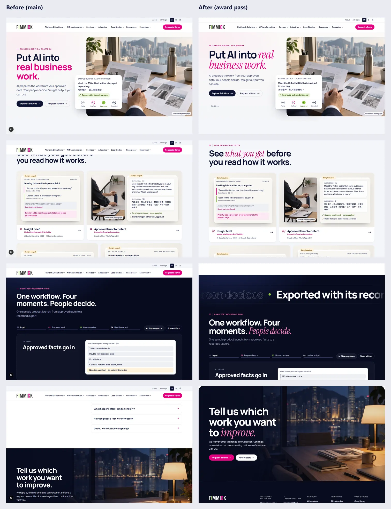

# Award pass — report (4 Oct 2026)

Branch `feat/award-polish`, based on `origin/main@4461f9a` (the merged cinematic redesign). Stack unchanged: Next.js 16, React 19, TypeScript, plain CSS. **No runtime dependencies added.**

**Goal:** raise craft to the level of Awwwards, Webby and FWA winners by repeated self-review: capture, critique, fix, re-capture and measure, until no new issue turned up. The constraints in `docs/redesign/design-decisions.md` were kept:

- Motion is CSS-driven, with no animation library.
- Nothing loops, scroll-jacks or plays audio.
- Everything respects `prefers-reduced-motion`.
- The LCP photograph does not animate at load.

## Self-review rounds

| Round | Found | Fixed |
|---|---|---|
| 0 — baseline critique | Single-family type with little contrast in the headlines; a heavy two-row header that never yields; one generic fade as the only motion; flat surfaces; a link-farm footer; inner pages styled differently from the homepage | — |
| 1 — editorial type, motion, footer | Hairline drawn over the hero card. Header never hid: the drawer's close button carries `aria-expanded="true"`, so `:has([aria-expanded="true"])` always matched. Inverted-logo filter turned the lime "I" muddy. Desktop hero grid overrode the mobile layout (copy column collapsed to 150 px). Traditional Chinese hero wrapped "。" onto its own line. | Hairline removed; selector scoped to `.pillar-trigger`; light logo generated; desktop grid scoped to ≥1000 px; CJK hero sized to fit the unbroken accent phrase |
| 2 — inner pages and detail | Inner-page heads lacked the display language. The global 404 rendered in Times New Roman: it never loaded Manrope, so `var(--font-manrope)` was undefined and the whole `font-family` declaration was invalid (this predates the pass). | Section heads share the wipe and scale; serif numerals; scroll cue; fonts moved to `app/fonts.ts` and applied by both root layouts |
| 3 — constraints and finish | Inertial smooth scrolling (Lenis, tried in round 1) conflicted with the recorded rules "no animation library" and "no scroll-jacking". The cursor bubble used a JavaScript rAF loop. | Lenis removed; the bubble eases with a CSS transition. Added reading-progress hairline, menu and drawer stagger, closing "sheet" rise. |
| 4 — performance | Two interleaved Lighthouse batches put the award build behind the baseline (medians 66 vs 79 and 71 vs 78; FCP about +260 ms). A CDP breakdown under 4× CPU throttling showed that both builds spend about 3.8 s in layout before the first frame, because the whole 12,000 px page is laid out up front. The award pass added about 200 ms of layout and 60 ms of style on top. | `will-change` removed (it forced a GPU layer per photo); scroll drift limited to the large editorial photos; hero photo fully static. Most of all, `content-visibility: auto` on page bands below the fold. |

| 5 — production parity | Production did not match what was reviewed on the dev server. `award.css` had also been imported by `global-not-found.tsx`, so Turbopack hoisted it into the shared stylesheet that loads *before* `cinematic.css`. Every equal-specificity override then lost: the hero type scale, the hero grid and `overflow: clip`. Separately, `overflow: hidden` on photo frames made each frame a scroll container, so the photo drift, the marquee and the hero-copy exit never moved. | Shared rules moved to `app/styles/editorial.css`; `award.css` is layout-only again. Timeline ancestors use `overflow: clip`. The hero-copy range starts at `exit 0%` (view timelines inset by `scroll-padding-top`, which had dimmed the copy to 95 % at rest). A new e2e test fails if `award.css` ever loses the cascade in a production build; it was run red against the broken build first. |

A measurement mistake was also caught. The first A/B ran against an orphaned `next start` process still serving the pre-rebuild build. Those numbers were discarded, and every later run first checked which build each port served.

## What changed

### Stylesheets

- `app/styles/editorial.css` holds the shared accent face and the 404 headline (imported by both root layouts; it overrides nothing, so its position in the bundle does not matter).
- `app/styles/award.css` holds the rest and **must be imported only by the locale layout**, after `cinematic.css`. The e2e test "award styles win the cascade in the production bundle" guards this.

### Typography

- **Editorial accent.** Each display headline sets one phrase in *Instrument Serif italic*, using `components/motion/Headline.tsx`. Examples: "Put AI into *real business work.*" and "One workflow. Four moments. *People decide.*"
  - The accessible name is still the plain sentence. The accent is an `<em>`, and the masks are presentational spans.
  - Chinese pages keep the sans face and carry the accent in colour only, because the serif has no CJK glyphs.
- **Scale.** Hero up to 5.9 rem and section heads up to 4.4 rem, with tighter tracking. Inner pages use a denser version: page hero up to 4.1 rem, section heads up to 3.1 rem.
- **Details.** Serif italic numerals on the output tiles and start options, chapter indices (01–09) on the homepage eyebrows, and magenta `::selection`.

### Motion (all CSS; off with reduced motion)

| Moment | Technique |
|---|---|
| Hero headline | Words rise out of masks once. The photo is untouched at load and stays the LCP element. |
| Section heads (home and every `SectionHead`) | Polygon clip wipe plus rise, once, via the existing reveal observer. The observer now also picks up nodes added after mount, so nothing can stay hidden. |
| Photographs | Scroll-linked drift (`animation-timeline: view()`) on the large editorial images: the two doors, the ecosystem photo, the closing chapter and inner-page photo bands. Movement happens only while the visitor scrolls. The hero photo is fully static; only the hero copy eases away as it exits. |
| Dark-chapter marquee | The four workflow moments as an outline/solid band. Scroll-linked, not a looping marquee; `aria-hidden` because the stage below carries the content. |
| Closing chapter | Rises as a rounded sheet (composited scale tied to its entry). |
| Header | Glass bar. It sheds the utility row once you scroll, steps away on downward scroll, and returns on upward scroll. It stays put while a menu is open or focus is inside it, and has a reading-progress hairline. |
| Menus | Mega-panel groups and drawer rows arrive in sequence. |
| Route changes | Content rises on client-side navigation only; the first load never waits. |
| Media links | A "View / Explore / Read the case" bubble on fine pointers. Its position eases with a CSS transition, and the system cursor is replaced only while the bubble exists. |
| Hero scroll cue | Line drops three times, then rests (desktop with tall viewports only). |

Scroll-driven effects are progressive enhancement. Chromium and Safari 26 animate them; other browsers show the static layout.

### Surfaces and components

- Fine grain on the dark chapters and footer only.
- Cards use a hairline ring instead of a border, plus a deeper tinted shadow on hover.
- Output "paper" lifts and tilts on hover. Industry cards reveal their output line on hover and focus.
- Buttons press, arrows travel, and text links draw their underline from the left.

### Rendering

Page bands below the fold (`main section.section`, the closing chapter and the footer) use `content-visibility: auto` with `contain-intrinsic-size: auto 800px`.

- They skip layout and paint until they come near the viewport, so the first frame lays out only the header and hero.
- Content stays in the DOM, the accessibility tree, anchors and find-in-page.
- `auto` remembers each band's real height once rendered, so scrolling back up does not jump.
- Heroes are not bands and are always rendered.

See the performance section below for the measurements.

### Footer and 404

- **Footer.** Dark, continuing from the closing chapter, with a large CTA ("Have a workflow *in mind?*", e-mail, Request a Demo).
  - The CTA is hidden on the homepage, which already ends with one.
  - `public/brand/fimmick-logo-light.{png,webp}` is generated from the approved logo: neutral greys become white, and the lime and magenta are untouched.
- **404.** Both 404 pages use the brand typography and the accent headline.

## Verification

Local production build (`next start`).

| Check | Result |
|---|---|
| `npm run typecheck`, `npm run lint` | Pass |
| `npm test` | 23/23 |
| `npm run build` | Pass, 1,549 static pages |
| `npx playwright test` | 25/25, including the new cascade test. The `NoFallbackError` log lines come from the 404 test and appear identically on the untouched baseline. |
| axe-core 4.13 (WCAG 2.2 A/AA) after full scroll | 0 violations on: `/en` (reduced and full motion), `/zh-hant`, an industry page, `/en/platform` and the 404 |
| 200 % zoom (720×450 at DPR 2) | 0 px horizontal overflow on `/en`, `/zh-hant` and a solution page |
| Keyboard (40 Tab stops) | Logical order, visible focus on every stop, nothing hidden under the sticky header. The skip link was flagged by the heuristic but hit-tests as the topmost element. |
| Interactions (scripted) | Header hide/show, mega menu holds the header, bubble shows the card's label, client navigation resets scroll and plays the entrance, mobile drawer opens full-screen with no bubble. No console errors. |

### Performance A/B (Lighthouse 13, mobile, simulated throttling)

Baseline and award builds were served side by side and measured in alternating order, with the dev server stopped. Single runs on this machine vary by ±10 points, so only interleaved medians are compared.

**Applied throttling.** 10 interleaved cold loads per build, mobile 412×823, real 4× CPU throttling, 150 ms RTT, 1.6 Mbps; medians from CDP `Performance.getMetrics`. This is the method the decisions above were based on.

| | First paint | LCP | Layout | Style | Script |
|---|---|---|---|---|---|
| Baseline (`main`) | 3.20 s | 3.20 s | 2.70 s | 276 ms | 365 ms |
| Award pass | **2.61 s** | **2.61 s** | **1.87 s** | **223 ms** | 395 ms |

**Lighthouse 13 (simulated throttling).** 5 interleaved pairs on the final build:

| | Perf (median, range) | LCP | FCP | TBT | Speed Index | CLS | A11y | Best practices | Weight |
|---|---|---|---|---|---|---|---|---|---|
| Baseline | 81 (80–91) | 3.26 s | 1.45 s | 454 ms | 2.38 s | 0 | 100 | 100 | 322 KB |
| Award pass | 76 (63–86) | 3.49 s | 1.48 s | 584 ms | 2.79 s | 0 | 100 | 100 | 345 KB |

The two methods disagree. Lantern (Lighthouse's simulator) extrapolates from an unthrottled trace and does not credit the layout skipped by `content-visibility`; applied throttling measures it directly.

Read honestly, the award build:
- paints first and reaches LCP about 18 % sooner under real mobile throttling;
- scores within Lighthouse's run-to-run spread, but with a lower median;
- carries a higher Speed Index because the hero text arrives over about 1 s.

Field data (CrUX) after release is the arbiter.

## Known limits

- **Speed Index** is higher because the hero text arrives over about 1 s. This is the deliberate cost of the entrance; LCP (the photo) and CLS are unaffected.
- **Not run:** a screen-reader pass, real devices, and Firefox/Safari by hand (scroll-driven effects fall back to static there).
- **Accent copy:** the accent phrases live in `components/home/sections.tsx` (`accents`). If a headline's copy changes and the phrase is no longer found, the headline renders without an accent rather than breaking.
- **Smooth scrolling** is available as a one-file opt-in if the "no scroll-jacking" rule is ever relaxed (Lenis was integrated and measured in round 1, then removed).
